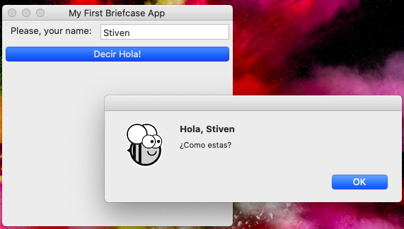
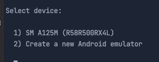
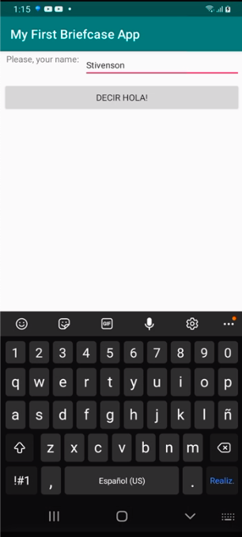
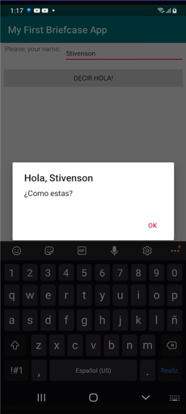

# My First Python App on Android
======================

###  Suite of tools and libraries used:

- [Briefcase](https://github.com/beeware/briefcase): Tool for converting a Python project into a standalone native application.
- [BeeWare](https://beeware.org/): Project that allows you to write your app in Python and release it on multiple platforms.

### Requirements

- python 8+
- openjdk 17+

### To run as desktop app (dev mode):

- Run `cd myfirstbriefcaseapp`
- Run `virtualenv .environment`
- Run `source .environment/bin/activate`
- Run `.environment/bin/python -m pip install briefcase`
- Run `briefcase dev`
- And you should see the app, in my case i have mac:

### To run in **Android**

- Run `cd myfirstbriefcaseapp`
- Run `export JAVA_HOME=/usr/local/opt/openjdk`
- Run `briefcase create android`
- Run `briefcase build android`
- Select the emulator o real device to run app:
  
  

- all, ready, on my android looks like this:

 
 
